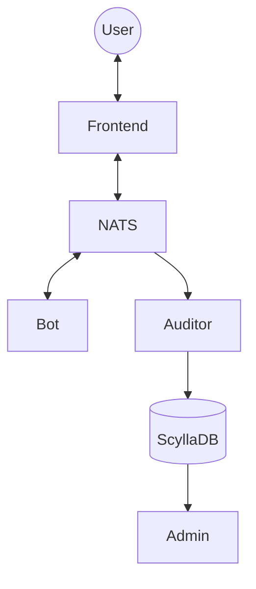

# yalo-preparation
This demo project started as a preparation before I joined Yalo, but then turned into a toy project I'm working on to demo some really nice technologies to my folks at Yalo, and which can perhaps be used for multiple purposes but mainly messaging and extreme performance ingestion of data.

## Technologies (current)
The technologies I'm using here are, basically:
* Go, as a very efficient language for the server-side applications
* ScyllaDB, as a higher-performance replacement for Cassandra
* NATS/JetStream, as a high-performance and very flexible messaging system (NATS) with durability guarantees (JetStream)

## Technologies (future)
I'm also working on evolving the project to have a user UI and an admin UI, and for this I'll need to use:
* NodeJS, as the application server for the user UI
* TypeScript, as a safer language as a replacement for JS
* HapiJS, as the web framework for NodeJS
* Gin, as the web framework for Go

## Architecture

I originally started drawing a CQRS-based architecture, but then I came up with another idea:

The main idea is to use NATS so that we can decouple the Bot workers from the Auditor workers, in such a way that the frontend component (but on server-side, with NodeJS) sends messages from the user to NATS, and then both the Bot and Auditor workers can do their magic. The Bot just replies to the messages, whereas the Auditor saves all messages (both from the user and from the Bot) to the database.

This can be accomplished with "queue groups", by NATS, where we can have multiple instances of Bot and multiple instances of Auditor running, for high availability, acting as if they were message queue consumers (ensuring delivery of a message only once **per group**).

With this architecture we still have some separation between reads and writes, especially regarding the auditing of messages (the Auditor writes, the admin API reads), but then the Bot is responsible for both reading from NATS and writing replies back to it. Which is fine, because we can have as many Bot instances as we want, making them perfectly scalable.
